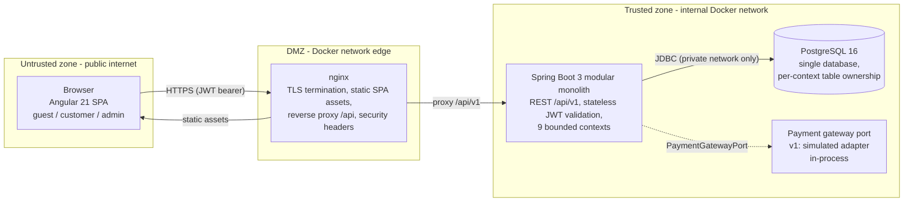
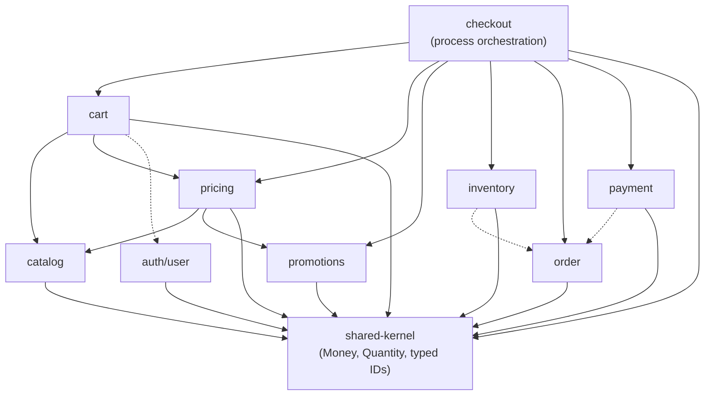
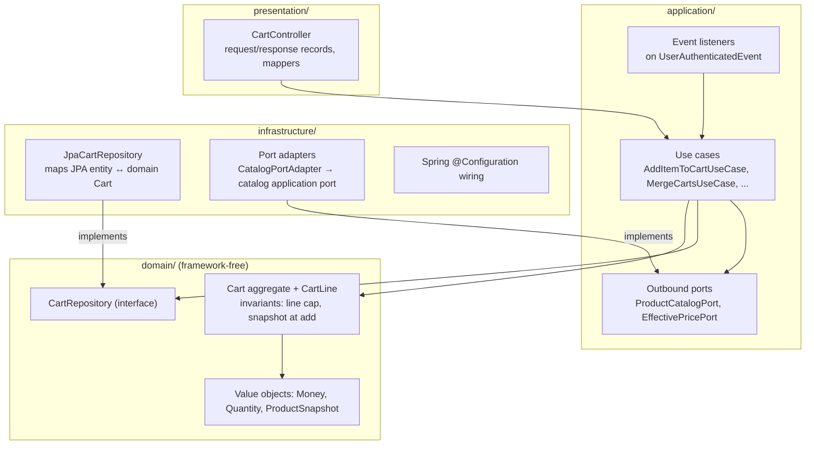
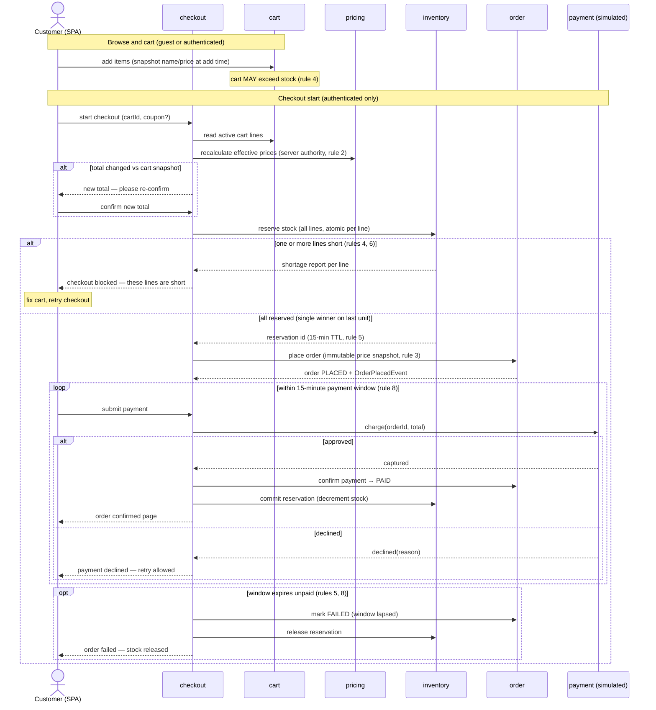

# Architecture Overview

> Owner: software-architect · Date: 2026-07-13 · Basis: ADR-0001 (modular monolith, Clean/Hexagonal), ADR-0002 (stack, IDs)
> Companion: `docs/architecture/domain-model.md` (contexts, aggregates, events, glossary)

## 1. System Context

A single-currency ecommerce store. Guests browse, search, and build carts; purchasing requires an
account (no guest checkout in v1). Customers check out with server-verified prices and reserved
stock, track orders through an explicit lifecycle, and may cancel until shipped. Admins manage
catalog, prices, stock, promotions/coupons, and order lifecycles — every admin action is audited.
Payment is a port with a **simulated adapter** in v1; shipping is flat-rate; prices are
tax-inclusive. Non-goals: multi-currency, multi-warehouse, marketplace, subscriptions, real PSP,
carrier integration, tax engine, recommendations.

The system is one Angular 21 SPA + one Spring Boot 3 modular monolith + one PostgreSQL database,
deployed with Docker Compose behind nginx, built by GitHub Actions.

## 2. Quality Attributes → Mechanisms

| Quality attribute (priority order) | Requirement source | Mechanism |
|---|---|---|
| Correctness: no oversell, exactly one winner | Rule 6 | Stock reservation as atomic conditional update inside one DB transaction (inventory context owns the row); checkout fails the losing request with per-line shortage detail (rule 4) |
| Correctness: coupon caps never exceeded | Rule 9 | Coupon redemption = atomic counter check-and-increment in the promotions context, same-transaction as order placement decision; one coupon per order enforced by the Order aggregate |
| Correctness: price authority & final snapshots | Rules 2, 3 | Pricing context recalculates at checkout; changed total → customer re-confirmation step; Order copies name/price into OrderLines (snapshot pattern) — orders never re-read catalog (rule 10) |
| Correctness: money | Non-goal (multi-currency) | `Money` value object, `BigDecimal` cents, single currency, arithmetic only inside the VO |
| Security: authN/authZ | Actors table | Spring Security stateless JWT; role model guest/customer/admin; ownership checks on every by-ID access (ADR-0002); admin surface audited (rule 11) |
| Security: enumeration/IDOR recon | ADR-0002 | UUIDv7 public identifiers (pending security-engineer sign-off) + mandatory ownership checks |
| Maintainability | Global rules | Nine bounded contexts, identical internal layering, context map in `domain-model.md`; ArchUnit-enforced boundaries (ADR-0001 Compliance) |
| Testability ≥ 80% domain/application | Global rules | Framework-free domain, ports faked in-memory, Testcontainers for adapters |
| Performance | Budgets TBD (performance-engineer) | In-process context calls; indexed catalog search; SPA lazy routes/@defer; nginx caching for static assets |
| Auditability | Rules 11, 12 | Every order transition recorded with time + actor; admin action audit log (append-only) |

## 3. General Architecture (trust boundaries)

Trust rules: nothing from the browser is trusted (validation at presentation layer + domain
invariants); the SPA is untrusted code — all authorization decisions happen in the API; PostgreSQL
is reachable only from the API container; the simulated payment adapter sits behind the same port a
real PSP adapter would implement later.

## 4. Module / Bounded-Context Dependency Diagram (acyclic)

Solid arrows = synchronous calls through the target's application-layer **ports**.
Dashed arrows = dependency on the target's **domain events** (consumed after commit).
No context ever touches another context's entities, repositories, or tables.

Edge list (for cycle verification — topological order exists: shared-kernel → {catalog, promotions,
auth, order} → {pricing, inventory, payment} → cart → checkout):

| Context | Depends on (ports →, events ⇢) |
|---|---|
| shared-kernel | — |
| catalog | shared-kernel |
| promotions | shared-kernel |
| auth/user | shared-kernel |
| order | shared-kernel |
| pricing | catalog →, promotions →, shared-kernel |
| inventory | order ⇢ (restock on `OrderCancelledEvent`), shared-kernel |
| payment | order ⇢ (refund on `OrderCancelledEvent`), shared-kernel |
| cart | catalog →, pricing →, auth ⇢ (`UserAuthenticatedEvent` → merge), shared-kernel |
| checkout | cart →, pricing →, promotions →, inventory →, order →, payment →, shared-kernel |

Design notes:
- **checkout** is a pure orchestrator (process manager): it owns the `CheckoutSession` aggregate,
  the 15-minute payment window, and coordinates everything else through ports. It is the only
  context allowed to depend on six others — the coupling is concentrated where the business process
  actually lives.
- **order** depends on nothing but the shared kernel: it is a state machine over immutable
  snapshots, driven through its inbound ports and observed through its events. This keeps the most
  audited aggregate the most isolated.
- **promotions** is the SHOULD seam: `pricing` calls `PromotionPolicyPort` from day one; v1 wires a
  no-discount adapter. Delivering promotions later changes no other context.
- **shared-kernel** is deliberately tiny: `Money`, `Quantity`, typed IDs (`ProductId`, `OrderId`,
  `CustomerId`, …). Anything with behavior beyond value semantics belongs to a context, not here.

## 5. Main Components — layers within one context

Every context has the same internal shape (example: cart). Dependencies point inward only
(ADR-0001; `.claude/docs/conventions.md` package layout).

Cross-cutting rules (apply to all contexts):
- **Transactions** begin and end at the use case (application layer). One transaction modifies one
  aggregate; cross-aggregate effects go through after-commit domain events
  (`@TransactionalEventListener(phase = AFTER_COMMIT)`).
- **Errors**: domain throws intention-revealing exceptions; one global `RestControllerAdvice` maps
  them to RFC 9457 Problem Details. No stack traces to clients.
- **Mapping**: each boundary maps explicitly (request record → command, domain → response record,
  JPA entity → domain). Inner layers never see outer shapes.

## 6. Purchase Flow (sequence, with failure branches)

Covers rules 2, 4, 5, 6, 8: price re-confirmation, per-line shortage, reservation + 15-min window,
single oversell winner, declined-payment retry, window lapse.

Post-purchase (not in diagram): `PLACED → PAID → CONFIRMED → SHIPPED → DELIVERED`; customer cancel
until shipped emits `OrderCancelledEvent`, consumed after commit by **inventory** (restock) and
**payment** (refund) — rules 7, 12. Every transition is recorded with timestamp + actor.

## 7. Deployment & CI (summary)

- Docker Compose services: `nginx` (SPA + reverse proxy), `api` (Spring Boot), `db` (PostgreSQL,
  volume-backed, healthcheck-gated). One image per service, multi-stage builds.
- GitHub Actions gate order: build → unit tests → ArchUnit boundary tests → integration tests
  (Testcontainers) → coverage gate (≥ 80% domain/application) → image build.
- Flyway runs migrations on API startup; migrations are append-only (`.claude/docs/conventions.md`).
