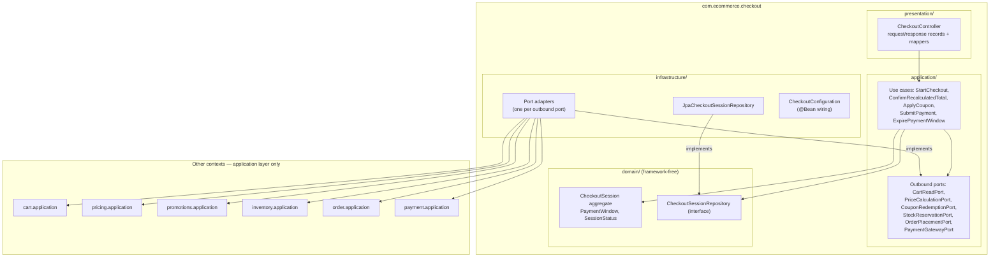

# Backend Architecture

> Owner: backend-lead · Date: 2026-07-13 · Basis: ADR-0001 (modular monolith, Clean/Hexagonal),
> ADR-0002 (stack, UUIDv7 IDs), `architecture-overview.md`, `domain-model.md`
> Design-only: no code. Schema is owned by database-engineer; API contracts by the api-guidelines
> doc (separate deliverable); authN/authZ design by `security-architecture.md` (referenced, never
> duplicated here).

## 1. Layering Within Each Bounded Context

Every one of the nine contexts (`catalog`, `cart`, `checkout`, `order`, `payment`, `inventory`,
`pricing`, `promotions`, `auth`) has the identical four-layer shape. Uniformity is the point: a
reviewer or agent who knows one context knows all nine.

| Layer | Contains | May depend on | Framework exposure |
|---|---|---|---|
| `domain` | Aggregates, entities, value objects, domain services, domain events, repository **interfaces** | nothing (+ shared-kernel VOs) | **None.** No Spring, JPA, Jackson imports — ArchUnit-enforced |
| `application` | One class per use case, outbound ports, command/result records, event listeners | `domain`, shared-kernel | `@Transactional`, `@TransactionalEventListener`, `@PreAuthorize` only |
| `infrastructure` | JPA entities + repository adapters, port adapters to other contexts, external adapters (payment simulator), `@Configuration` wiring | `application`, `domain` | Full (JPA, Spring) |
| `presentation` | REST controllers, request/response records, boundary mappers | `application` (never `domain` entities outward, never `infrastructure`) | Web MVC, Bean Validation |

**Dependency rule** (ADR-0001): source dependencies point inward only —
`presentation → application → domain`; `infrastructure → application | domain`; no inverse edge,
no `presentation → infrastructure`. Crossing skips nothing: controller → use case → domain.
Controller → repository is a violation. Each boundary maps explicitly (request record → command,
domain → result record, JPA entity ↔ domain object); inner layers never see outer shapes.

Representative context — **checkout**, the process orchestrator, including its cross-context port
edges from the acyclic module graph (overview §4):



The checkout adapters call the *target context's* application-layer ports/use cases — never its
repositories, JPA entities, or tables (ADR-0001 compliance rule 3). Checkout is the only context
permitted six outbound context dependencies; every other context's fan-out is fixed by the edge
list in overview §4.

## 2. Package Layout

Single Maven module in v1 (one deployable, ADR-0001); boundaries enforced by package convention +
ArchUnit, not Maven modules. Splitting into Maven modules later is an architect decision.

```text
com.ecommerce
├── EcommerceApplication              # @SpringBootApplication, empty
├── shared                            # shared-kernel: Money, Quantity, typed IDs
│   └── (flat — pure value objects only; additions need architect approval)
├── common                            # cross-cutting infrastructure, NOT business logic
│   ├── web        # ApiExceptionHandler (single RestControllerAdvice), correlation-id filter
│   ├── config     # profiles glue, Jackson, Clock bean, @ConfigurationProperties registration
│   └── security   # filter chain, JWT decoding, CurrentUserPort adapter — implements
│                  # security-architecture.md verbatim; design questions go back there
└── <context>                         # × 9: catalog, cart, checkout, order, payment,
    │                                 #      inventory, pricing, promotions, auth
    ├── domain
    │   ├── model    # aggregate, entities, VOs, domain services
    │   ├── event    # domain events (the ONLY domain types other contexts may import)
    │   └── (repository interfaces at domain root, one per aggregate root)
    ├── application
    │   ├── usecase  # one class per use case + its command/result records
    │   ├── port     # outbound ports (the ONLY application types other contexts may import)
    │   └── listener # @TransactionalEventListener consumers of other contexts' events
    ├── infrastructure
    │   ├── persistence  # JPA entities, Spring Data interfaces, repository adapters
    │   ├── adapter      # implementations of this context's outbound ports
    │   └── config       # @Configuration wiring for this context's beans
    └── presentation
        ├── (controllers at root)
        └── dto          # request/response records + mappers
```

Placement rules:
- **shared-kernel** = `com.ecommerce.shared`. Value semantics only; anything with behavior belongs
  to a context (domain-model §1).
- **Wiring** lives in each context's `infrastructure.config` (`@Bean` methods binding adapters to
  ports). App-wide plumbing (Jackson, `Clock`, correlation-id filter, the exception advice, the
  security filter chain) lives in `com.ecommerce.common.*` — `common` never contains business
  logic and no context depends on `common` from its `domain` layer.
- Component scanning stays within `com.ecommerce`; adapters and third-party beans are wired with
  explicit `@Bean` methods, not blanket stereotypes (skill `spring-boot`).

## 3. Cross-Context Communication Rules

Two mechanisms exist; nothing else (no shared entities, repositories, tables, or direct use-case
class references across contexts — ADR-0001).

**Synchronous — application ports.** Used when the caller needs an answer *now* to proceed:
checkout → inventory `reserve(...)`, cart → catalog product lookup, pricing → promotions
`PromotionPolicyPort`. The calling context declares the port in its own `application.port` package
with domain/shared-kernel types in the signature; its `infrastructure.adapter` implements it by
invoking the target context's application layer in-process. Each port call executes in the
**target's own transaction** (domain-model §2 ownership rules) — the caller composes outcomes, it
never composes transactions.

**Asynchronous — after-commit domain events.** Used for reactive side effects where the producer
must not know or wait for consumers: `UserAuthenticatedEvent` → cart merge,
`OrderCancelledEvent` → inventory restock + payment refund. Events are past-tense facts published
after commit of the producing transaction; consumers depend only on the producer's
`domain.event` types. The authoritative list is the **event catalog in `domain-model.md` §4** —
new events are added there first, then implemented.

Decision test: *"Does the current use case need the result to decide its next step?"* Yes → port.
No (fact already happened, others react) → event. The purchase flow (overview §6) is deliberately
port-driven — reservation, placement, and payment results all gate the next step — while
post-purchase effects (cancel → restock/refund) are event-driven.

## 4. Transaction Policy

1. **Boundary = the use case.** `@Transactional` on the use-case class in the application layer.
   Never on controllers; never on repository adapters (their statements join the ambient
   transaction).
2. **`readOnly = true` is the default for every query-only use case** — no exceptions; a
   read path without it is a review finding. `spring.jpa.open-in-view` is `false` from day one.
3. **One transaction modifies one aggregate** (ADR-0001). Cross-aggregate consistency goes through
   after-commit events, or — for checkout — sequential port calls where each call is the target
   context's own committed transaction.
4. **No external I/O inside a transaction.** Concretely for the purchase flow (overview §6):
   `SubmitPaymentUseCase` calls `PaymentGatewayPort.charge(...)` **outside** any open transaction
   (v1's simulated adapter is in-process, but the rule is written for the real PSP the port
   anticipates). Sequence: tx A commits the attempt intent → gateway call, no tx →
   tx B records the outcome and drives the order transition (→ PAID via order port) and the
   reservation commit (via inventory port). The stock reservation itself happened earlier, in
   `StartCheckoutUseCase`, inside inventory's own transaction — the 15-minute window exists
   precisely so no transaction spans the payment wait.
5. **Events are handled AFTER_COMMIT**: `@TransactionalEventListener(phase = AFTER_COMMIT)`, each
   handler opening its own new transaction. Every event-consuming PR names its consistency story:
   what happens if the handler fails (retry, reconciliation job, or accepted-and-logged) — per
   skill `transactions`. Formalization of the publication pattern is the follow-up ADR named in
   ADR-0001.
6. **Propagation**: `REQUIRED` everywhere; `REQUIRES_NEW` only for must-commit-independently
   records — and *not* for the admin audit log, which per `security-architecture.md` §6c commits
   in the **same transaction** as the audited mutation (an action without its audit row must not
   commit).
7. **Isolation**: PostgreSQL `READ_COMMITTED` + optimistic locking (`@Version` on cart, stock,
   coupon aggregates). Oversell/coupon-cap correctness uses atomic conditional UPDATE /
   check-and-increment inside the owning context's transaction (overview §2) — never blanket
   `SERIALIZABLE`.

## 5. Error-Handling Architecture

- **Sealed domain hierarchy**: `DomainException` (sealed, runtime) permits `NotFoundException`,
  `ConflictException`, `BusinessRuleException`; contexts extend the leaves with final,
  intention-revealing types (`InsufficientStockException`, `PaymentWindowExpiredException`,
  `IllegalOrderTransitionException`). Each carries a stable `type` slug + structured properties —
  no message formatting at throw sites. Domain exceptions live in `domain` and import nothing.
- **Expected alternate outcomes are results, not exceptions**, decided per aggregate: payment
  declined → sealed `PaymentResult`; per-line stock shortage → shortage report returned by the
  reservation port (rule 4 requires the data, not a throw). Exceptions mark rule *violations*.
- **One `@RestControllerAdvice`** (`common.web.ApiExceptionHandler`) for the whole API:
  `NotFoundException` → 404, `ConflictException` → 409, `BusinessRuleException` → 422,
  `MethodArgumentNotValidException` → 400 with field errors, anything unmapped → 500 generic.
  No per-controller try/catch for response shaping; no 200-with-error-payload, ever.
- **RFC 9457 Problem Details** on every error: `type` (slug under
  `https://api.ecommerce.dev/problems/`), `title`, `status`, `detail`, `instance` + structured
  extensions. The slug registry is part of the API docs; frontend keys UX off `type`, tests assert
  `type` + `status`, never message text.
- **500s leak nothing**: correlation id (per-request filter + MDC) + generic message; class names,
  SQL, and stack frames stay in logs. Levels: 5xx → `ERROR` with stack trace; expected business
  failures → `WARN`/`INFO` without; validation 400s → metrics, not logs.
- **401/403 shapes**: the security filter chain's authentication entry point and access-denied
  handler emit the *same* Problem Details shape — semantics (generic bodies, ownership failures
  are 404 not 403, anti-enumeration) are defined in `security-architecture.md` §2.6/§3.3 and
  implemented verbatim.

## 6. Configuration & Wiring

- **Typed properties**: every config group is a `@ConfigurationProperties` record with
  `@Validated` constraints (`CheckoutProperties(Duration paymentWindow, ...)`,
  `CartProperties(Duration guestTtl, int maxItems)`, `JwtProperties(...)`) — no scattered
  `@Value`. Invalid config fails startup, not runtime.
- **Profiles** `dev` / `test` / `prod`: differences are *values* in `application-<profile>.yml` +
  env vars, never conditional code paths and never profile-specific business beans. Optional
  integrations toggle via `@ConditionalOnProperty`.
- **Secrets are env-only with no defaults** in any yml — a missing secret fails startup loudly.
  Inventory of secrets, rotation rules, and `.env` handling: `security-architecture.md` §5.1
  (owner of the policy; backend-lead owns the config wiring, devops the injection).
- **Adapter wiring**: each context's `infrastructure.config` `@Configuration` class binds its
  adapters to ports with explicit `@Bean` methods — one place per context to read the wiring, and
  the seam where test configurations substitute in-memory fakes. Constructor injection only,
  fields `final`.
- Baseline invariants pinned in `application.yml`: `spring.jpa.hibernate.ddl-auto=validate`
  (Flyway owns the schema), `spring.jpa.open-in-view=false`, actuator exposing `health`
  (and `metrics` internally) only.

## 7. ArchUnit Compliance Rules

Required CI check (gate order in overview §7). Rules 1–5 restate ADR-0001 Compliance; 6–10 are
added by this document.

| # | Rule name | Asserts |
|---|---|---|
| 1 | `domain_is_framework_free` | No class in `..domain..` depends on `org.springframework..`, `jakarta.persistence..`, `com.fasterxml..` |
| 2 | `layers_point_inward` | Per context: `presentation → application → domain`; `infrastructure → application\|domain`; no inverse edges; no `presentation → infrastructure` |
| 3 | `cross_context_via_ports_and_events_only` | Classes in `com.ecommerce.<A>` depend on `com.ecommerce.<B>` only via `..<B>.application.port..` or `..<B>.domain.event..` |
| 4 | `context_slices_are_acyclic` | `slices matching com.ecommerce.(*)..` are free of cycles (edge list in overview §4 is the reference topology) |
| 5 | `one_repository_per_aggregate_in_domain` | Repository interfaces reside only in `domain`, named `<AggregateRoot>Repository`; none elsewhere |
| 6 | `transactions_only_in_application` | `@Transactional` appears only on classes in `..application.usecase..` — never presentation or infrastructure |
| 7 | `controllers_never_touch_repositories` | No class in `..presentation..` depends on any `..Repository` type or `..infrastructure.persistence..` |
| 8 | `jpa_entities_stay_in_infrastructure` | Types annotated `@Entity` reside in `..infrastructure.persistence..`; no port or use-case signature references them |
| 9 | `event_listeners_are_after_commit` | Methods annotated `@TransactionalEventListener` declare `phase = AFTER_COMMIT` |
| 10 | `shared_kernel_depends_on_nothing` | `com.ecommerce.shared..` has no dependency on any context package or on Spring/JPA/Jackson |
| 11 | `audit_repository_is_append_only` | The admin-audit repository interface exposes no update/delete methods (security-architecture §6c) |

Review-checklist items that resist mechanization (from ADR-0001): every new cross-context call
names its port in the PR; any layering exception cites an ADR number.

## Performance budgets (owner: performance-engineer)

| Endpoint class | p95 (server-side, at controller) |
|---|---|
| Catalog reads (product detail, category page) | ≤ 200 ms |
| Search (filtered + paginated) | ≤ 300 ms |
| Cart mutations (add / update / remove) | ≤ 150 ms |
| Checkout start (recalc + reserve, all lines) | ≤ 500 ms |
| Payment submit → order PAID (simulated PSP) | ≤ 800 ms |
| Admin reads / writes | ≤ 1 000 ms / ≤ 500 ms |

- Payload: DTO projections only (never entities); single resource ≤ 30 KB, list page ≤ 100 KB uncompressed. JSON compressed at nginx.
- Pagination: mandatory on every collection endpoint; default page size 20, server-enforced hard cap 100 (clamped, never honored above). No unbounded `findAll` anywhere.
- N+1 rule: SQL statement count on hot paths must be constant, independent of result-set size. Integration tests assert counts: point read ≤ 3 statements, list page ≤ 5, checkout start ≤ 15.
- Measurement: Micrometer per-endpoint timers via Actuator; load runs (k6/Gatling) against the Compose stack at the DB seed volumes defined in database-design.md.
