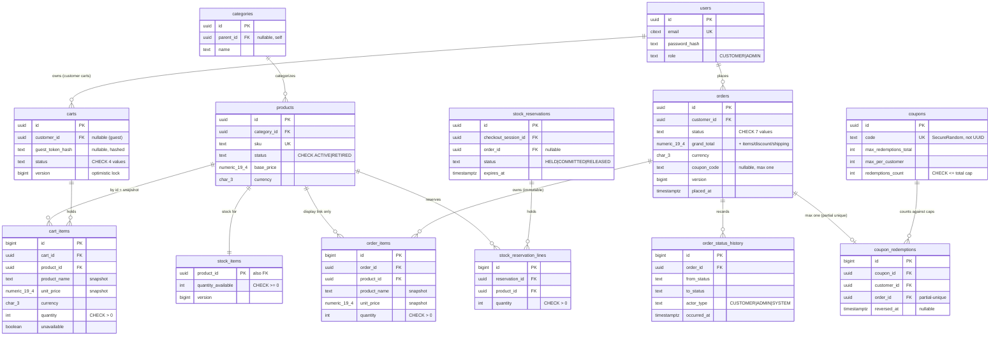

# Database Design

> Owner: database-engineer · Date: 2026-07-13 · Basis: `domain-model.md`, ADR-0001, ADR-0002 (ID
> sub-decision signed off in `security-architecture.md` §6a), `security-architecture.md` §6c.
> Design-only: this document specifies tables, constraints, and indexes. No migration files exist
> yet; V001+ will be authored from this spec using `templates/database-migration.md`.

## 1. Schema-per-context mapping

**Decision: one flat PostgreSQL schema (`public`), plural snake_case table names, no context
prefixes.** Postgres schemas-per-context were considered and rejected for v1: the modular monolith
(ADR-0001) is one deployable with one application DB role and one Flyway history; module boundaries
are enforced where they live — in code (one repository per aggregate root, ArchUnit context rules)
— not by `search_path` juggling, cross-schema grants, and per-schema Flyway configuration that
JPA/Testcontainers would have to mirror. Table ownership below is the boundary document. If a
context is ever extracted to a service, its tables move with it via expand–migrate–contract; a
schema prefix today buys nothing toward that. Cross-context FKs are declared deliberately (see §3.6)
— accepted coupling inside one database, revisited only at extraction time.

### Table inventory (context → tables)

| Context | Table | Purpose (one line) |
|---|---|---|
| catalog | `products` | Product identity, current base price, ACTIVE/RETIRED status; never deleted (rule 10). |
| catalog | `categories` | Category tree (self-referencing parent), catalog navigation/filtering. |
| catalog | `product_images` | Ordered image URLs per product (child rows). |
| cart | `carts` | Shopping intent per guest (hashed token) or customer; status ACTIVE/MERGED/ORDERED/ABANDONED. |
| cart | `cart_items` | One line per product with `ProductSnapshot` (name + unit price at add time) and unavailable flag. |
| checkout | `checkout_sessions` | Orchestration state: recalculated totals, applied coupon, reservation/order refs, 15-min payment deadline, idempotency key. |
| inventory | `stock_items` | One row per product: available quantity — the row the atomic conditional decrement targets (rule 6). |
| inventory | `stock_reservations` | Reservation header: HELD/COMMITTED/RELEASED + expiry (payment window sweep). |
| inventory | `stock_reservation_lines` | Reserved quantity per product under one reservation. |
| inventory | `stock_movements` | Append-only ledger of every stock change (reserve/commit/release/admin adjust) with reason + actor. |
| order | `orders` | Immutable purchase snapshot: totals, status machine, max one coupon code (rules 3, 9). |
| order | `order_items` | `LineSnapshot` per line: name, unit price, quantity at placement time. |
| order | `order_status_history` | Append-only transition log: from → to, actor, timestamp (rule 12). |
| payment | `payments` | One payment record per order (simulated gateway in v1). |
| payment | `payment_attempts` | Every attempt: approved/declined + reason + gateway reference (rule 8 retries). |
| payment | `refunds` | Refunds issued on cancellation (rule 7). |
| promotions | `promotions` | Admin-defined automatic discount rules with validity windows (SHOULD seam — table ships, delivery deferred). |
| promotions | `promotion_targets` | Product/category scoping rows for a promotion (exactly one target kind per row). |
| promotions | `coupons` | Coupon definition: code, discount, validity, total + per-customer caps, atomic redemption counter. |
| promotions | `coupon_redemptions` | One row per redemption (customer, order); reversal via `reversed_at`, never DELETE. |
| auth/user | `users` | Identity, email (case-insensitive unique), BCrypt hash, role CUSTOMER/ADMIN. |
| auth/user | `addresses` | Customer profile addresses (child rows). |
| auth/user | `refresh_token_families` | One row per login session family: absolute 14-day expiry, revocation state (§2.3/6b security doc). |
| auth/user | `refresh_tokens` | Hashed one-time tokens within a family; `used_at` + `replaced_by` drive reuse detection. |
| auth/user | `password_reset_tokens` | Hashed single-use reset tokens, ≤ 1h TTL (security §2.6). |
| auth/user | `admin_audit_log` | Append-only admin action log: actor, action, target, before/after JSONB, correlation id, IP (security §6c). |
| shared-kernel | — | No tables. `Money`, `Quantity`, typed IDs map to column conventions (§4), never to their own tables. |

`pricing` owns no tables (stateless price authority). Domain events are not persisted in v1
(no outbox table); if reliable async delivery is ever needed, an outbox is a new ADR.

## 2. Core model — ERD (key columns only)

## 3. Integrity strategy — PO rules as constraints

Principle: if a rule can be a constraint, it is one. Application bugs must not be able to persist
a state the PO rules forbid.

1. **One ACTIVE cart per identity** — partial unique indexes:
   `uq_carts_customer_active` on `carts (customer_id) WHERE status = 'ACTIVE'` and
   `uq_carts_guest_token_active` on `carts (guest_token_hash) WHERE status = 'ACTIVE'`.
   Plus `ck_carts_identity`: exactly one of `customer_id` / `guest_token_hash` is non-null.
2. **Snapshots are columns, not joins** — `cart_items` and `order_items` carry
   `product_name`, `unit_price`, `currency` copied at add/placement time. `product_id` remains
   only as a typed reference for display linkage; no read path reconstructs a price via join
   (rules 3, 10). Orders additionally freeze `items_total, discount_total, shipping_total,
   grand_total` on the `orders` row.
3. **Check constraints everywhere a domain says so** — `quantity > 0` (cart/order/reservation
   lines), every money column `>= 0` (plus `grand_total >= 0`, coupon never below zero — rule 9),
   every status column `text` + `CHECK (status IN (...))` listing exactly the domain-model values
   (transitions stay in the domain; valid *values* are enforced here). `redemptions_count BETWEEN 0
   AND max_redemptions_total` on `coupons`. Reservation `expires_at > created_at`.
4. **Atomic conditional update — oversell (rule 6)**: reservation is a single-statement
   conditional decrement on `stock_items`:
   `UPDATE ... SET quantity_available = quantity_available - :n WHERE product_id = :p AND
   quantity_available >= :n` — zero rows updated = shortage report for that line. The
   `CHECK (quantity_available >= 0)` is the backstop; the row lock lasts only the statement.
   Every change also inserts a `stock_movements` ledger row in the same transaction.
5. **Atomic conditional update — coupon caps (rule 9)**: redemption is
   `UPDATE coupons SET redemptions_count = redemptions_count + 1 WHERE id = :c AND
   redemptions_count < max_redemptions_total`. The row lock this takes serializes all concurrent
   redemptions of the same coupon, which makes the per-customer count over `coupon_redemptions`
   (checked in the same transaction, before the insert) race-free. **Max one coupon per order** is
   declarative: partial unique `uq_coupon_redemptions_order` on `coupon_redemptions (order_id)
   WHERE reversed_at IS NULL`. Reversal sets `reversed_at`; rows are never deleted.
6. **FK on-delete policy** — `ON DELETE RESTRICT` from all reference data: `products`, `users`,
   `categories` (a delete attempt on referenced reference data must fail loudly; retirement is a
   status, not a DELETE — rule 10). `ON DELETE CASCADE` only parent → child inside one aggregate
   (`carts → cart_items`, `orders → order_items`/`order_status_history`,
   `stock_reservations → stock_reservation_lines`, `payments → payment_attempts`/`refunds`,
   `refresh_token_families → refresh_tokens`). Cross-context FKs (e.g., `order_items.product_id →
   products.id`) are declared — accepted monolith coupling, always RESTRICT.
7. **Append-only, enforced at grant level (security §6c)** — the application role receives
   `INSERT, SELECT` but **not** `UPDATE, DELETE` on `admin_audit_log`, `order_status_history`, and
   `stock_movements`. This ships in the same migration that creates each table. The audit row is
   written in the same transaction as the audited mutation. Retention ≥ 1 year, no purge path.
8. **Emails**: `citext` + unique constraint (`uq_users_email`) — DB-level uniqueness backs the
   anti-enumeration flow (security §2.1). Token columns (`guest_token_hash`, refresh/reset token
   hashes) store hashes only, each with a unique index.

## 4. Type conventions

| Concern | Convention |
|---|---|
| Money | `numeric(19,4)` amount + `char(3)` currency code, always paired; never `float`/`money`. Domain `Money` (BigDecimal) maps 1:1. |
| Time | `timestamptz` for every instant (`created_at`/`updated_at` on every table, default `now()`); `date` only for date-only facts. |
| IDs — user-visible aggregate roots | `uuid` (UUIDv7, app-generated): `products`, `categories`, `carts`, `checkout_sessions`, `stock_reservations`, `orders`, `payments`, `promotions`, `coupons`, `users` (per ADR-0002 + security §6a sign-off). |
| IDs — child / history / audit rows | `bigint generated always as identity`: `cart_items`, `order_items`, `order_status_history`, `stock_movements`, `stock_reservation_lines`, `product_images`, `promotion_targets`, `coupon_redemptions`, `payment_attempts`, `refunds`, `addresses`, `refresh_*`, `admin_audit_log`. |
| `stock_items` | PK = `product_id uuid` (identifying 1:1 with `products`) — no surrogate. |
| Status columns | `text` + `CHECK (status IN (...))` — never native enums (cheaper to evolve). |
| Text | `text` + `check (char_length(...) <= n)` per conventions; no unbounded user text. |
| Email | `citext` unique (fallback: `unique (lower(email))` expression index if the extension is vetoed). |
| Bearer secrets | Never UUIDv7 (security §6a): coupon `code`, token hashes are SecureRandom-derived `text`. |
| JSONB | Only `admin_audit_log.before_state/after_state` (genuinely schemaless, never filtered relationally). |

## 5. Indexing strategy (design-time)

Rule restated from skill `indexing`: **every index names its query** — no index ships without the
query (or FK/uniqueness reason) recorded in its migration doc; speculative indexes are rejected;
removal with `pg_stat_user_indexes` evidence is part of the job.

| Index (spec) | Query it serves |
|---|---|
| `uq_products_sku` unique | Admin/product import lookup by SKU. |
| `idx_products_category_active` on `products (category_id, base_price) WHERE status = 'ACTIVE'` | Catalog browse/filter: category page, ACTIVE only, price sort/filter. |
| Product name search | Text search likely needs GIN/trigram — **deferred to an ADR with measured need** (skill `indexing` rule 6); v1 starts with `lower(name)` prefix matching on the partial index above. |
| `uq_carts_customer_active`, `uq_carts_guest_token_active` (partial uniques, §3.1) | Active-cart lookup by customer id / by hashed guest token — point lookups; double as business rules. |
| `uq_cart_items_cart_product` unique `(cart_id, product_id)` | Line upsert on add-to-cart; leading column serves the cart→items join. |
| `idx_cart_items_product_id` | RESTRICT check + "flag retired product in carts" scan by product. |
| `idx_orders_customer_placed` on `orders (customer_id, placed_at DESC) INCLUDE (status, grand_total, currency)` | Order history list — equality + sort, covering: index-only scan for the page. |
| `uq_order_items_order_product` unique `(order_id, product_id)` | Order detail join; one line per product per order. |
| `idx_order_items_product_id` | RESTRICT check on products; admin "orders containing product X". |
| `idx_order_status_history_order` on `(order_id, occurred_at)` | Order detail timeline. |
| `idx_reservations_expiry_held` on `stock_reservations (expires_at) WHERE status = 'HELD'` | Payment-window expiry sweep (rule 5/8): tiny partial index over only held rows. |
| `uq_coupons_code` unique | Coupon apply: point lookup by code. |
| `idx_coupon_redemptions_coupon_customer` on `(coupon_id, customer_id)` | Per-customer cap count inside the redeeming transaction (§3.5). |
| `uq_coupon_redemptions_order` partial unique (§3.5) | Max-one-coupon-per-order rule; order-detail lookup. |
| `uq_users_email` unique (citext) | Login / registration-conflict point lookup. |
| `uq_refresh_tokens_hash` unique; `idx_refresh_tokens_family` | Refresh rotation lookup by presented hash; family-wide revocation. |
| `idx_checkout_sessions_deadline_open` on `(payment_deadline) WHERE status = 'AWAITING_PAYMENT'` | Session expiry sweep. |
| `uq_checkout_sessions_idempotency` unique `(idempotency_key) WHERE idempotency_key IS NOT NULL` | Idempotent placement/payment (security §1.4.6). |
| `idx_audit_target` on `admin_audit_log (target_type, target_id, occurred_at DESC)`; `idx_audit_actor` on `(actor_user_id, occurred_at DESC)` | Admin audit review screens ("what happened to X", "what did admin Y do"). |
| `idx_stock_movements_product` on `(product_id, created_at DESC)` | Stock ledger per product (admin). |

FK child columns not listed above get an index only when a real query joins/filters from the child
side or the parent takes deletes (skill rule) — reviewed per migration, not blanket-applied.

## 6. Flyway conventions

Per skill `flyway` — summarized, binding:

- `V<zero-padded>__<snake_case>.sql` in `db/migration`; one concern per file; `R__` repeatables for
  idempotent reference/seed data (`insert ... on conflict do nothing`).
- Applied migrations are immutable; fixes are new versions. `flyway repair` is local-dev only.
- App config `ddl-auto: validate` — Flyway is the only schema authority.
- Destructive changes follow expand–migrate–contract across releases; never drop/rename in the
  release that stops writing the old shape. Backfills batched, never one giant transaction.
- Safety analysis mandatory per `templates/database-migration.md` (locks, volumes, forward-fix).
  `create index concurrently` (with `-- flyway:executeInTransaction=false`) on hot tables.
- Testing rule: every migration verified two ways via Testcontainers — clean from V001, and
  previous-version → new (wired with test-engineer).
- The append-only grants (§3.7) are part of the table-creating migrations, not an afterthought.

## 7. JPA handoff notes (backend-lead)

- **Optimistic locking**: `version bigint not null default 0` ships on `carts`, `stock_items`,
  `orders`, `checkout_sessions` — map as `@Version`; `OptimisticLockException` → 409.
- **Lazy everything**: all associations `LAZY` (including `@ManyToOne`); fetch per use case with
  `join fetch`/`@EntityGraph` (order detail = order + items + history in one query).
- **Projections for list views**: order history and catalog lists map to record projections
  matching the covering indexes in §5 — never load entities for 5 columns. Keyset pagination
  beyond page ~50 (see §8).
- **Modifying queries, not load-modify-save**: stock reserve/release/commit and coupon
  redeem/reverse are `@Modifying` conditional UPDATEs (§3.4–3.5) returning affected-row counts —
  the count is the success signal. Loading `StockItem`/`Coupon` entities to mutate them reopens
  the race the schema closed. Stock ledger + audit rows insert in the same transaction.
- **IDs**: UUIDv7 generated app-side (aggregate has identity pre-persist); bigint children use
  `GenerationType.IDENTITY`. No `AUTO`.
- **Snapshots** map as `@Embeddable` value objects over the snapshot columns; `citext` email maps
  as plain `String`.
- Cascade + `orphanRemoval` only on the compositions cascaded in §3.6; never across aggregates.
  The audit repository exposes insert/read only (ArchUnit-asserted, security §6c).

## 8. Performance budgets (owner: performance-engineer)

| Query class | Ceiling (p95, at seed volume) |
|---|---|
| Point lookup (PK / unique index) | ≤ 5 ms |
| List / order-history page (paginated) | ≤ 50 ms |
| Catalog search with filters | ≤ 100 ms |
| Checkout-critical locking ops (conditional stock decrement, coupon check-and-increment) | ≤ 20 ms; lock held only within its own statement/transaction |

- Seed volumes for plan-sensitive testing (mandatory before any plan is accepted): 50 000 products,
  200 categories, 20 000 customers, 100 000 orders, 400 000 order_items, 10 000 active carts —
  including skewed shapes (a customer with 500 orders, a category with 10 000 products).
- EXPLAIN evidence rule: every query touching a table > 10 000 rows ships with
  `EXPLAIN (ANALYZE, BUFFERS)` at seed volume; no Seq Scan on products/orders/order_items for
  selective predicates; keyset pagination required beyond page depth ~50.

## 9. Friction with the domain model (reported, not silently diverged)

1. **Coupon identity**: ADR-0002 lists `coupon` under UUIDv7 user-visible aggregates, but security
   §6a mandates the *code* (the public identifier customers type) be full-entropy SecureRandom, not
   a UUID. Resolution here: `coupons.id uuid` (internal PK/FK target) + `code` unique (public
   identity). Consistent with both documents; noted so nobody "simplifies" code into the PK.
2. **Per-customer coupon cap** is not expressible as a declarative constraint; it relies on the
   coupon-row lock serializing redemptions (§3.5). The total cap and one-per-order rules *are*
   declarative. Architect should confirm this partial delegation is acceptable.
3. **`password_reset_tokens`** appears in no domain aggregate — added from security §2.6; auth/user
   context owns it.
4. `Coupon`'s internal `Redemption` entity becomes the `coupon_redemptions` table with a
   `reversed_at` update on reversal — so it is *not* in the grant-level append-only group (unlike
   history/audit/ledger tables); reversal is a legal domain operation, not tampering.
