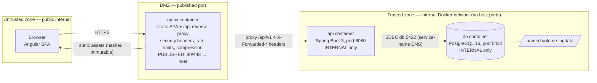

# Deployment Architecture

> Owner: devops-engineer · Date: 2026-07-13 · Basis: `architecture-overview.md` (§3 trust zones, §7 deployment summary), `security-architecture.md` (§5 secrets & edge hardening — referenced, never restated), `backend-architecture.md` (§6 config, ArchUnit rules, performance budgets), `.claude/docs/quality-gates.md` (CI enforcement)
> Status: design-only. This document states the requirements the future Dockerfiles, compose files, workflows, and nginx config must meet. No implementation files exist yet.

## 1. Topology

Three compose services — `nginx` (SPA + reverse proxy), `api` (Spring Boot), `db` (PostgreSQL) — on one internal Docker network. Only nginx publishes a host port. Trust zones match overview §3: everything from the browser is untrusted; the database is reachable only from the API container.



- **Published vs internal**: `nginx` is the only service with a `ports:` mapping in the base compose file. `api` and `db` are addressed by service name on the default network. A published DB port is a dev-only convenience and lives exclusively in `compose.override.yaml` — never the base file.
- **Volumes**: one named volume `pgdata` for PostgreSQL data. Bind mounts exist only in the dev override for source reload. `docker compose down -v` is the documented, safe full reset.
- **Trust boundary enforcement**: the network layout *is* part of the security design (security-architecture §1.3) — the JDBC surface is unreachable from the host or internet by construction, not by firewall discipline.

## 2. Image Strategy (requirements for the future Dockerfiles)

Per skill `docker`; these are acceptance criteria, not suggestions.

1. **Multi-stage, always.** Backend: Maven + JDK 21 build stage → JRE 21 runtime stage (`eclipse-temurin:21-jre-alpine` class of image). Frontend: `node:22-alpine` build stage → `nginx:1.27-alpine` static stage. Build tools, source, and caches never reach a final layer.
2. **Pinned bases, digest-preferred.** Exact tags at minimum (`postgres:16-alpine`, matching the version Testcontainers uses in CI); SHA-256 digests where security-engineer's supply-chain bar (A08) requires. `latest` is banned everywhere.
3. **Non-root runtime.** Both final stages create and switch to an unprivileged user; read-only root filesystem where feasible.
4. **Layered Spring Boot jar.** Extract with `jarmode=layertools` so dependencies / snapshot-deps / application classes are separate layers — an app-only change pushes kilobytes.
5. **Layer order = change frequency.** Dependency manifests (`pom.xml`, `package-lock.json`) copied and resolved before source; `npm ci`, never `npm install`.
6. **No secrets at any build stage.** No ARG/ENV tokens; `.dockerignore` excludes `.git`, `node_modules`, local env files.
7. **Container-aware JVM**: `-XX:MaxRAMPercentage`, never fixed `-Xmx`.
8. **Traceability labels**: `org.opencontainers.image.revision` (git SHA), `source`, `created` on every image built in CI.
9. **Image scan** (Trivy or equivalent) in the pipeline; critical CVEs in base images fail the build per security-engineer's policy (Gate 4 / A06).

## 3. Compose Environments

One base `compose.yaml` shaped like production; environments differ **only by override files and env values** (parity rule — never divergent service definitions).

| Environment | Mechanism | What differs |
|---|---|---|
| dev | `compose.override.yaml` (auto-merged) | published DB port, source bind mounts for reload, verbose logging profile |
| test | `compose.test.yaml` via `-f` | ephemeral DB (no volume), test env values; CI integration tests use Testcontainers with the *same* postgres tag |
| prod-like | base file + `.env` values | resource limits (`mem_limit`), prod Spring profile, TLS-ready nginx |

Requirements:

- **Config via environment only**: `env_file: .env` + interpolation. `.env` is gitignored; **`.env.example` is maintained and complete** — every variable, dummy value, one comment each (secrets policy: security-architecture §5.1). No literal secret in any compose file, dev included.
- **Healthcheck-gated startup**: every service defines a `healthcheck`; `depends_on` uses `condition: service_healthy`. Order: `db` healthy → `api` starts; `api` healthy → `nginx` starts. The backend never races the database.
- **Named volume `pgdata`** for the database; nothing else persists state.
- **Profiles for optional tooling**: pgadmin, mail-catcher, or load-test harnesses go behind `--profile tools` — never in the default `up` path.
- **Stable service names** (`nginx`, `api`, `db` per overview §7) — they are hostnames baked into config (JDBC URL, nginx upstream).

**Onboarding invariant** (project success criterion): clean clone → copy `.env.example` to `.env` → `docker compose up` → working store. This path is tested regularly; if it breaks, that is a P1 infrastructure defect. There are no manual steps — anything not scripted does not exist.

## 4. CI/CD Pipeline Design (GitHub Actions)

Triggers: `pull_request` runs the full verification; `push` to `main` additionally builds and labels images. Nothing runs only on main that could have failed the PR.

Gate order — cheapest first, fail fast (each stage is a required check):

| # | Job / stage | What it runs | Quality gate enforced |
|---|---|---|---|
| 1 | `lint-format` | Frontend lint; backend format/style check | Gate 2 (conventions) |
| 2 | `build-unit` | Compile + unit tests (backend `-Dgroups=unit`, frontend `npm test`) | Gate 3 (unit tests) |
| 3 | `archunit` | ArchUnit boundary suite (backend-architecture §7, rules 1–11) | Gate 2 (layering/SOLID conformance) |
| 4 | `integration` | Testcontainers against real PostgreSQL 16 (same tag as compose), incl. N+1 statement-count assertions | Gate 3 (integration) / Gate 5 (query counts) |
| 5 | `coverage` | JaCoCo check — ≥ 80% line coverage on domain + application layers (floor owned by qa-engineer) | Gate 3 (coverage) |
| 6 | `dependency-audit` | Maven + npm dependency scan; fails on known critical CVEs | Gate 4 (A06) |
| 7 | `frontend-budgets` | `ng build` with `angular.json` budgets (initial ≤ 500 KB error, per-route ≤ 200 KB) — build fails mechanically on breach | Gate 5 (bundle budgets) |
| 8 | `image-build` | Build both Dockerfiles (the *same* ones compose uses), Trivy scan, OCI labels with git SHA; publish on main only | Gate 2/4 (reproducible, scanned artifacts) |

Workflow hygiene requirements:

- **Required checks = merge blockers**: branch protection marks jobs 1–7 required. Editing a workflow to skip or weaken a gate is a global-rules violation; a red pipeline is never overridden manually — escalation goes to the orchestrator.
- **Pinned actions** (`@v4` minimum, SHA-pinned per security-engineer's A08 bar) — never `@main`.
- **Least-privilege `permissions`**: `contents: read` default per workflow; jobs grant only what they use (e.g. `packages: write` solely on the publish job).
- **Lockfile-keyed caching**: Maven cache keyed on `pom.xml` hash, npm on `package-lock.json`. Never cache build outputs that encode test results.
- **Concurrency cancellation**: `group: ${{ github.ref }}`, `cancel-in-progress: true` — superseded commits are not verified.
- Failures surface in `$GITHUB_STEP_SUMMARY` (coverage table, lint summary), not buried in logs. Backend and frontend job chains run in parallel.
- Application-caused failures route back to the owning lead; this pipeline never gets `continue-on-error` band-aids and devops never patches application source to green a build.

## 5. nginx Requirements

The nginx config (in-repo, copied into the frontend image) must satisfy — values and full header list owned by **security-architecture §5.2**, applied here, verified against that checklist before merge:

- **SPA fallback**: `try_files … /index.html` so deep links load the app; exact-match locations for control files (health, `robots.txt`) precede the catch-all. Missing hashed assets return 404, never `index.html`.
- **Cache split**: `index.html` → `Cache-Control: no-cache`; hashed build assets → `public, max-age=31536000, immutable` (see budgets §8).
- **/api proxy**: `proxy_pass` to `api:8080` with forwarded headers (`Host`, `X-Real-IP`, `X-Forwarded-For`, `X-Forwarded-Proto`) — the API must see real client info for auth-event logging and per-IP decisions. CORS is owned by Spring config, never duplicated in nginx.
- **Security headers baseline + `server_tokens off` + body-size limits + HTTP→HTTPS/HSTS posture**: per security-architecture §5.2 — this document does not restate values.
- **Rate limiting zones**: tight `limit_req` on `/api/v1/auth/**` and the coupon-apply endpoint, sane default elsewhere — per security-architecture §5.2 and §2.2 (complemented by app-level per-account limits).
- **Compression**: gzip (brotli if the image provides it) for text/JS/CSS/JSON per the budget in §8; never recompress media.
- **Proxy timeouts**: read timeout 10 s per the budget in §8 — aligned with the worst API latency budget; anything slower is a defect to fix, not a timeout to raise.
- Access log format includes request time + upstream time so performance-engineer can attribute latency (edge vs backend).

## 6. Secrets & Config Flow

One direction, no branches (policy owner: security-architecture §5.1; devops owns injection):

```
GitHub Secrets ──→ CI workflows (referenced, never echoed, never in artifacts/logs)
.env (gitignored) ──→ docker compose env interpolation ──→ container environment ──→ Spring @ConfigurationProperties
```

- Secrets (DB password, JWT signing key ≥ 256-bit, future SMTP/PSP creds) exist **only** as environment values. No defaults in any `application.yml` — a missing secret fails API startup loudly (backend-architecture §6), which the healthcheck turns into a visible unhealthy container, not a silent zombie.
- No secret in images (build args included), compose files, repo history, or logs. A committed secret is a rotated secret, immediately.
- `.env.example` is the contract: complete variable inventory, dummy values, one comment each — it rots, onboarding breaks, and that is treated as a build break.

## 7. Observability Plumbing (v1)

- **Logs**: stdout/stderr only (12-factor); `docker compose logs <service>` is the log access path. JSON log format in prod-like profile. Log-scrubbing rules (no tokens/secrets/PII) are Gate 4 concerns owned by security-engineer.
- **Actuator exposure policy**: `health` exposed unauthenticated (it is the compose healthcheck target and on the public allowlist); `metrics`/`prometheus` exposed **internal-only** — reachable inside the Docker network, never proxied by nginx (`/api/v1/actuator` has no proxy route; A05 minimal-exposure per security-architecture §4).
- **Correlation-id propagation**: the API's per-request correlation-id filter (backend-architecture §5) is the joining key; nginx logs must carry a request id forwarded as a header so an edge log line, an API log line, and an audit row correlate.
- **What performance-engineer needs for budget measurement**: Micrometer per-endpoint timers via Actuator (backend budgets), nginx request/upstream timing in access logs (edge attribution), and a stable prod-like compose target for k6/Gatling load runs at the seed volumes in `database-design.md`. Devops provides the plumbing; budget values and verdicts belong to performance-engineer.

## Performance budgets (owner: performance-engineer)

- Startup: API container start → healthy (incl. Flyway) ≤ 60 s; nginx ≤ 5 s; db healthcheck-gated before api starts.
- Healthchecks: interval 10 s, timeout 5 s, retries 5, api `start_period` 60 s.
- CI: full gate pipeline (build → tests → ArchUnit → Testcontainers → coverage → images) ≤ 10 min on GitHub-hosted runners, with Maven/npm layer caching.
- nginx: gzip (brotli if available) for text/JS/CSS/JSON ≥ 1 KB; hashed static assets `Cache-Control: public, max-age=31536000, immutable`; `index.html` `no-cache`; proxy read timeout 10 s (aligned with worst API budget — anything slower is a defect, not a timeout to raise).

## Open Dependencies

| Blocked item | Waiting on | Owner |
|---|---|---|
| Final security header values / CSP / rate-limit numbers in nginx config | security-architecture §5.2 checklist application review | security-engineer |
| Coverage floor confirmation (80% seed from quality-gates) | testing-strategy document | qa-engineer |
| TLS termination decision for prod-like (self-signed vs host-provided) | deployment target definition | orchestrator / product-owner |
