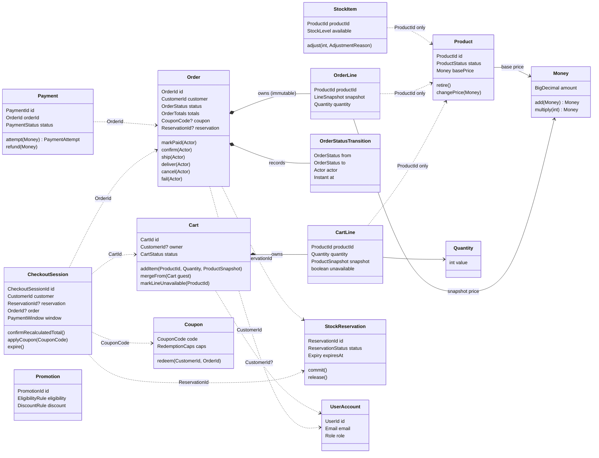

# Domain Model

> Owner: software-architect · Date: 2026-07-13 · Basis: ADR-0001, ADR-0002
> Aligned 1:1 with the module dependency diagram in `docs/architecture/architecture-overview.md` §4.
> Design-only: names and invariants, no code. All cross-aggregate references are **by typed ID**.

## 1. Bounded Contexts and Responsibilities

### shared-kernel
The smallest possible set of value objects with pure value semantics, shared by all contexts:
`Money` (BigDecimal cents, single currency, arithmetic inside the VO, never negative where the rule
demands it), `Quantity` (positive integer, per-line cap aware), and the typed identifiers
(`ProductId`, `CartId`, `OrderId`, `CustomerId`, `CouponCode`, `ReservationId`, `PromotionId`).
Growth rule: anything with behavior beyond value semantics belongs to a context — additions require
architect approval.

### catalog
Owns what is sold: products, categories, and their **current** base prices, plus search/filter.
Source of truth for product identity, name, description, images, and availability status
(ACTIVE / RETIRED). Retiring a product never deletes it (rule 10) — past orders keep their
snapshots; carts learn of unavailability through the catalog port at read time. Admin CRUD on
products and prices lives here (audited, rule 11).

### pricing
The **server-side price authority** (rule 2). Given product IDs and quantities, it composes the
effective price: base price from catalog → applicable promotion discounts via `PromotionPolicyPort`
→ tax-inclusive total (no tax engine, non-goal) → flat shipping. Owns the rounding policy and the
price-composition order. Stateless in v1 — it computes, it does not store. Coupon application is
**not** here: coupons apply per order at checkout, after promo prices (rule 9).

### promotions (SHOULD seam — architecture now, delivery deferred)
Owns promotion definitions (eligibility, discount rules, validity windows) and the full coupon
lifecycle: definition, hard total-redemption cap, per-customer cap, validation, and **atomic
redemption** (rule 9 — caps never exceeded under concurrency; redemption is a check-and-increment
in the redeeming transaction). v1 ships the context boundary with a no-discount policy adapter for
pricing and full coupon support only if scheduled; nothing else changes when it lands.

### cart
Owns shopping intent for guests and customers. A cart line stores a `ProductSnapshot` (name, unit
price **at add time** — snapshot pattern; catalog changes never mutate carts). Carts MAY exceed
stock (rule 4). Owns the merge-on-login policy (rule 1): same product → quantities summed and
capped per line; conflicting carts → freshest wins. Flags lines whose product was retired
(rule 10). Guest carts persist server-side keyed by an anonymous cart token.

### checkout
The purchase **process orchestrator**. Owns the `CheckoutSession`: recalculated totals (via
pricing), the customer's re-confirmation when the total changed (rule 2), coupon validation and
redemption (via promotions port), stock reservation (via inventory port), order placement (via
order port), payment coordination and retries, and the **15-minute payment window** (rules 5, 8).
No catalog, stock, or price data is owned here — only process state.

### inventory
Owns stock levels and **reservations**. Guarantees the oversell rule (6): reserving the last unit
is an atomic conditional decrement — exactly one concurrent checkout wins; losers get a per-line
shortage report (rule 4). Reservations are committed (stock decremented for good) or released
(checkout failure/expiry, order cancellation → restock, rule 7). Admin stock adjustments live here
(audited).

### order
Owns the order aggregate: an **immutable snapshot** of what was bought at what price (rule 3) plus
a one-directional state machine `PLACED → PAID → CONFIRMED → SHIPPED → DELIVERED` with branches
`PLACED → FAILED` (payment window lapse, rule 8) and `PLACED|PAID|CONFIRMED → CANCELLED` (customer
cancel until shipped, rule 7; admin lifecycle management). Every transition records timestamp +
actor (rule 12). Depends on nothing but the shared kernel — driven by ports, observed via events.

### payment
Owns payment attempts and refunds behind `PaymentGatewayPort` — **v1 adapter is simulated**
(non-goal: real PSP). Records every attempt (approved/declined + reason) against an `OrderId`.
Consumes `OrderCancelledEvent` to issue refunds (rule 7). No card data is stored, ever — only
gateway references, real or simulated. Drives the order's `PLACED → PAID` transition synchronously
via `order.application.port.OrderPaymentPort` on a successful capture (ADR-0005); never transitions
an order to `FAILED` or `CANCELLED` — checkout's expiry sweep remains the sole owner of
`PLACED → FAILED` (ADR-0004).

### auth/user
Owns identity, credentials, roles (GUEST implicit, CUSTOMER, ADMIN), registration, login, JWT
issuance/refresh, and the customer profile/addresses. Publishes `UserAuthenticatedEvent` so cart
can merge (rule 1). Admins do not shop — role separation enforced here and checked per endpoint.
Also owns the **admin action audit log** (rule 11: who/what/when, append-only).

## 2. Aggregates, Entities, Value Objects (per context)

| Context | Aggregate root | Internal entities | Value objects | References out (by ID only) |
|---|---|---|---|---|
| catalog | `Product` | — | `ProductStatus`, `Sku`, `BasePrice (Money)`, `CategoryRef` | — |
| catalog | `Category` | — | — | parent `CategoryId` |
| pricing | — (stateless domain service `PriceCalculator`) | — | `PricedLine`, `PriceBreakdown`, `EffectivePrice (Money)` | `ProductId` |
| promotions | `Promotion` | — | `EligibilityRule`, `DiscountRule`, `ValidityWindow` | `ProductId` / `CategoryId` in rules |
| promotions | `Coupon` | `Redemption` | `CouponCode`, `RedemptionCaps (total, per-customer)` | `CustomerId`, `OrderId` per redemption |
| cart | `Cart` | `CartLine` | `ProductSnapshot (name, unit price at add)`, `Quantity`, `CartStatus (ACTIVE, MERGED, ORDERED, ABANDONED)` | `ProductId`, `CustomerId` (nullable for guest), guest cart token |
| checkout | `CheckoutSession` | — | `SessionStatus`, `PaymentWindow (deadline)`, `RecalculatedTotal`, `AppliedCoupon` | `CartId`, `CustomerId`, `ReservationId`, `OrderId` |
| inventory | `StockItem` | — | `StockLevel`, `AdjustmentReason` | `ProductId` |
| inventory | `StockReservation` | `ReservedLine` | `ReservationStatus (HELD, COMMITTED, RELEASED)`, `Expiry` | `ProductId`, `OrderId`, `CheckoutSessionId` |
| order | `Order` | `OrderLine`, `OrderStatusTransition` | `OrderStatus`, `OrderTotals (items, discount, shipping, grand — Money)`, `LineSnapshot (name, unit price, qty)`, `Actor (customer/admin/system)` | `CustomerId`, `ProductId` (for display linkage only), `CouponCode` (max one, rule 9), `ReservationId` (commit/release only, never displayed — ADR-0004) |
| payment | `Payment` | `PaymentAttempt`, `Refund` | `PaymentStatus`, `DeclineReason`, `GatewayReference` | `OrderId`, `CustomerId` |
| auth/user | `UserAccount` | `Address` | `Email`, `PasswordHash`, `Role` | — |
| auth/user | `AdminAuditEntry` (append-only) | — | `AuditAction (who, what, when)` | acting `UserId`, target resource id |

Ownership rules:
- One repository per aggregate root, nothing else (no `OrderLineRepository`).
- One transaction modifies one aggregate; cross-aggregate effects use after-commit events or the
  orchestrating checkout use case calling ports sequentially (each port call = target's own
  transaction).
- Aggregates never hold object references to other aggregates — typed IDs only.
- Snapshot pattern is mandatory where the PO rules demand it: `CartLine.ProductSnapshot` (add
  time), `OrderLine.LineSnapshot` (placement time). An order is never re-priced and never re-reads
  catalog (rules 3, 10).

## 3. Core Model — Class Diagram

Solid diamonds = ownership inside one aggregate/transaction boundary. Dotted arrows = by-ID
references across aggregate (and mostly context) boundaries — never object references.

## 4. Domain Events Catalog

All events are past-tense facts, published **after commit** of the producing transaction. The
consumer depends on the producer's event type (edges match the module diagram exactly).

| Event | Producer | Consumers (v1) | Purpose / rule |
|---|---|---|---|
| `UserRegisteredEvent` | auth/user | — (audit trail) | account created |
| `UserAuthenticatedEvent` | auth/user | cart (`MergeCartsUseCase`) | rule 1: merge guest cart into customer cart |
| `ProductRetiredEvent` | catalog | — in v1 (cart flags via read-time catalog port check) | rule 10; event kept for future subscribers |
| `ProductPriceChangedEvent` | catalog | — in v1 (checkout recalculates anyway, rule 2) | audit trail |
| `StockReservedEvent` / `StockReleasedEvent` | inventory | — (audit trail) | rules 5, 6 traceability |
| `OrderPlacedEvent` | order | — v1 audit; future: notifications | rule 12 |
| `OrderPaidEvent` | order | — (audit; reservation commit is a synchronous order→inventory port call, ADR-0004) | rule 12 |
| `OrderCancelledEvent` | order | — (audit; restock is a synchronous order→inventory port call, ADR-0004); future: payment (refund) | rule 7 |
| `OrderFailedEvent` | order | — (audit; release already done synchronously by checkout) | rules 5, 8 |
| `OrderShippedEvent` / `OrderDeliveredEvent` | order | — (audit; future notifications) | rule 12 |
| `CouponRedeemedEvent` / `CouponRedemptionReversedEvent` | promotions | — (audit; reversal on cancel/fail of the redeeming order is invoked via port by order-cancel flow) | rule 9 |
| `PaymentCapturedEvent` / `PaymentDeclinedEvent` / `PaymentRefundedEvent` | payment | — (audit; order consumes a successful capture synchronously via a port call, not this event — ADR-0005) | rule 8 |

Rules: events carry IDs + minimal facts, never full aggregates. "— (audit)" consumers still matter:
they feed the append-only audit/history requirements (rules 11, 12) without coupling contexts.

## 5. Ubiquitous Language Glossary

| Term | Meaning (the only allowed usage) |
|---|---|
| **Cart** | A guest's or customer's shopping intent; may exceed stock; never the word "basket". |
| **Cart merge** | On login: guest cart folds into the customer cart; same product → quantities summed, capped per line; conflicts → freshest cart wins. |
| **Product snapshot** | Name + unit price copied into a cart line **at add time**; immune to later catalog changes. |
| **Effective price** | The server-computed price after promotions, before coupon; the only price that counts at checkout. |
| **Price re-confirmation** | Checkout step forced when the recalculated total differs from what the customer saw. |
| **Checkout session** | The orchestration state from "start checkout" to paid-or-failed, including the payment window. |
| **Stock reservation** | A temporary hold on stock created at checkout; HELD → COMMITTED (paid) or RELEASED (failure/expiry/cancel). |
| **Payment window** | The 15 minutes after reservation during which payment may be attempted/retried; lapse fails the order and releases stock. |
| **Oversell** | Selling more units than stock; forbidden — concurrent last-unit checkouts have exactly one winner. |
| **Order** | The immutable record of a purchase: line snapshots + final totals; never re-priced. |
| **Order lifecycle** | `PLACED → PAID → CONFIRMED → SHIPPED → DELIVERED`, plus `FAILED` (window lapse) and `CANCELLED` (until shipped); one direction, every transition recorded with time + actor. |
| **Coupon** | A customer-entered code; max one per order, applied after promo prices, never takes a total below zero; capped globally and per customer. |
| **Promotion** | An admin-defined automatic discount rule (no code entry); priced by the pricing context via the promotion policy port. |
| **Retired product** | A product no longer for sale; stays visible in past orders; flagged unavailable in carts. |
| **Actor** | Who caused a recorded action: customer, admin, or system (e.g., window expiry). |

## 6. Where Does New Logic Go? (context map quick test)

- "Change how discounts stack" → **promotions** (rules) / **pricing** (composition order).
- "Cap cart line quantity" → **cart** domain invariant.
- "New order status" → **order** state machine + this document + a superseding note in ADR chain.
- "Reserve stock earlier/later" → **checkout** orchestration (when) + **inventory** (how).
- "Track failed login attempts" → **auth/user**.
- If two contexts both seem right, the owner is the one whose **invariant** is at stake; escalate
  to software-architect if still ambiguous.
