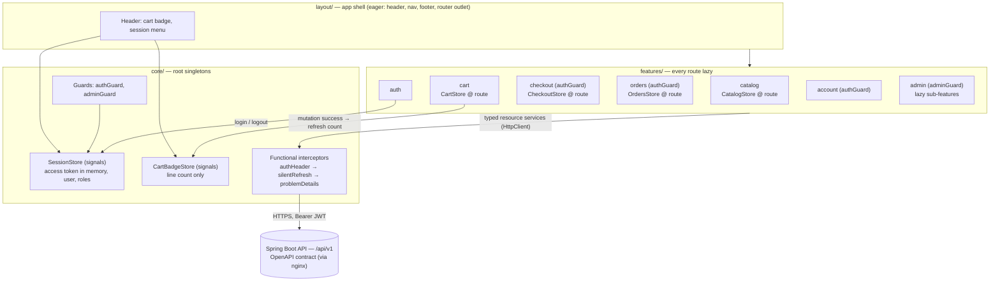

# Frontend Architecture

> Owner: frontend-lead · Date: 2026-07-13 · Basis: ADR-0001, ADR-0002, `architecture-overview.md`, `security-architecture.md` (§2 token handling), `.claude/docs/conventions.md`
> Status: design-only. No component code exists yet; implementation starts only when the OpenAPI contract and design spec exist.
> Skills applied: `angular`, `angular-signals`, `rxjs`, `tailwind`, `performance`, `accessibility`, `responsive-design`, `ecommerce-design-system`.

## 1. Application Structure

One Angular 21 SPA, standalone components only, `OnPush` everywhere, native control flow, structured
per conventions: `core/` (app-wide singletons), `shared/` (promoted after a *second* consumer, never
before), `features/<name>/` (each feature owns its routes, components, services, models),
`layout/` (shell). v1 features map to the user-facing slices of the backend contexts (overview §4).
Frontend features are *view* groupings, not bounded contexts — e.g. the `checkout` feature calls the
checkout API, which orchestrates six backend contexts; the SPA never re-implements that orchestration
and never re-derives business rules (prices, stock, coupon validity are backend truth).

```
src/app/
├── core/                        # singletons — provided in root, imported once
│   ├── auth/                    # SessionStore (access token in memory), authGuard, adminGuard
│   ├── http/                    # functional interceptors: auth header + silent refresh + problem-details mapping
│   ├── api/                     # base API config (/api/v1), shared pagination & ApiError models
│   └── cart/                    # CartBadgeStore (global line-count summary for the header)
├── shared/                      # ≥ 2 consumers rule; standalone components, pipes, directives
│   ├── ui/                      # price display, skeleton blocks, empty-state, error-retry panel
│   └── forms/                   # shared validators / error-display helpers mirroring backend rules
├── layout/                      # shell, header (cart badge, account menu), footer, nav
└── features/
    ├── catalog/                 # product list, search, product detail       → catalog API (public)
    ├── cart/                    # cart view, line editing                    → cart API (guest + customer)
    ├── checkout/                # confirm total, coupon, payment, result     → checkout API (customer only)
    ├── orders/                  # order list, order detail, cancel           → order API (ownership-scoped)
    ├── auth/                    # login, register, password reset            → auth API
    ├── account/                 # profile, addresses, password change        → user API
    └── admin/                   # catalog/prices/stock/promotions/orders     → /api/v1/admin/** (ADMIN)
        └── (lazy sub-features: products, promotions, orders, audit)
```

Each `features/<name>/` contains `<name>.routes.ts`, `components/`, `services/`, `models/`. Models
are TypeScript interfaces mirroring the OpenAPI response/request DTOs exactly — one `models/` per
feature, no cross-feature model imports (shared shapes like pagination live in `core/api`).
Component split rule: presentational (inputs/outputs, no stateful injection) vs container (injects
the feature store); split by responsibility, not size.



## 2. State Management Strategy

Signals-first, per skill `angular-signals`:

- **Feature signal stores, provided at the feature route** (`providers` in `<name>.routes.ts`), so
  store lifetime matches the lazy chunk and state is disposed with the feature. Pattern: private
  writable `signal()`s, public `asReadonly()` + `computed()` views, mutations only through named
  methods. Components never mutate shared state directly.
- **Global singletons — exactly two**: `SessionStore` (current user, roles, access token in memory —
  see §4 and security-architecture §2.3) and `CartBadgeStore` (header line count, updated after cart
  mutations and login-merge). Nothing else is `providedIn: 'root'` state without an update to this doc.
- **Derivation rules**: never store what can be computed. Cart subtotal, `isEmpty`, `canCheckout`,
  applied-filter chips are `computed()` over one source of truth. Displayed money is always the
  server-returned amount — `computed` formats, it never recalculates prices. `linkedSignal` for state
  that resets with its source (e.g. selected quantity resets when the product changes).
  `effect()` only for the outside world (analytics, focus management); an effect that sets another
  signal is a review-blocking design error.
- **Async data via `resource`/`httpResource`** keyed on signal params (route id, page, filters).
  Loading/error/value states come from the resource API — no hand-rolled `isLoading` booleans, no
  duplicated server state across signals (one resource, many computeds).
- **Signals-vs-RxJS boundary** (skills `angular-signals` r6, `rxjs`): observables remain only where
  *events over time need composition* — search typeahead (`debounceTime` → `distinctUntilChanged` →
  `switchMap`), router events, double-submit protection on checkout (`exhaustMap`), ordered cart
  mutations (`concatMap`). Every pipeline converts at the edge with `toSignal()`; state never
  round-trips signal → observable → signal; no manual `.subscribe()` in components except
  fire-and-forget with `takeUntilDestroyed()`.

## 3. Routing & Code-Splitting

- **Every feature is lazy** (`loadChildren` to the feature's routes file; leaf views via
  `loadComponent`). The initial bundle carries shell + first route only (budget §8). `admin` lazy-loads
  again internally per sub-feature so customer traffic never pays for admin code.
- **Functional guards**: `authGuard` (checkout, orders, account) redirects unauthenticated users to
  `/auth/login?returnUrl=…`; `adminGuard` gates `/admin/**`. Guards read `SessionStore` signals.
  Guards are UX only — all real authorization happens in the API (security-architecture §3); the SPA
  is untrusted code and hides, never protects.
- **Route-level providers**: each feature store is provided on its route (see §2), keeping stores out
  of the root injector and tree-shakable with the chunk.
- **Preloading — the money path**: a selective preloading strategy (route `data` flag, Angular
  built-in mechanism — no new dependency) preloads product-detail after product-list is interactive,
  and cart after detail. Checkout, orders, account, admin load strictly on demand. Within views,
  below-the-fold blocks use `@defer (on viewport)` with sized placeholders.

## 4. API Integration Layer

- **Contract-first, no exceptions**: integration starts only when the OpenAPI contract exists for the
  endpoint. Gaps or ambiguities go back to backend-lead through the orchestrator; the frontend never
  invents shapes, fields, or status semantics. One typed service per API resource
  (`ProductApiService`, `CartApiService`, …) returning feature models; pagination follows the
  conventions envelope (`content`, `page`, `totalElements`).
- **Functional interceptor chain** (order matters):
  1. `authHeaderInterceptor` — attaches `Authorization: Bearer <access token>` from `SessionStore`.
     The access token lives **in memory only** (never localStorage/sessionStorage); the refresh token
     is an httpOnly cookie the SPA cannot and does not read — full flow in security-architecture §2.3–2.5.
  2. `refreshInterceptor` — on 401 for a non-auth endpoint: silently `POST /api/v1/auth/refresh`
     (cookie-authenticated), queue concurrent requests behind the single in-flight refresh, replay
     with the new access token; if refresh fails (family revoked/expired), clear session and redirect
     to login with `returnUrl`.
  3. `problemDetailsInterceptor` — maps RFC 9457 `application/problem+json` bodies to a typed
     `ApiError` (type, title, status, detail, per-field violations for form mapping). **Components
     never see `HttpErrorResponse`**; form components receive typed field violations, everything else
     receives a displayable error with a retry affordance.
- Validators on typed reactive forms mirror the backend rules from the contract; errors show on
  touched + invalid, never pristine. Client validation is UX; the server re-validates everything.

## 5. UI States & UX Contract

Every routed view and every `resource`-backed block implements **all four states** — a missing state
is a review blocker:

| State | Rule |
|---|---|
| Loading | Skeletons sized to the final layout (exact heights/aspect ratios) — zero CLS by design; never spinner-only |
| Empty | Distinct from error; explains why and offers the next action (e.g. empty cart → "browse catalog") |
| Error | Human-readable message from the mapped `ApiError` + a retry action (`resource.reload()`); never a dead end, never a raw status code |
| Success | The designed view, per spec at every defined breakpoint (375 px up) |

**Optimistic UI is the exception, not the rule** — server truth wins by default. It applies only
where the design spec explicitly calls for it (expected: add-to-cart, quantity stepper): apply the
signal update immediately, keep the previous state, roll back and surface the mapped error on
failure (e.g. insufficient stock), then reconcile with the server-confirmed cart. Checkout is
**never** optimistic: totals, stock reservation, and payment results are rendered only from server
responses (overview §6 — re-confirmation on total change, per-line shortage reports).

## 6. Styling Architecture

- Tailwind bound to **design-system tokens** (skill `ecommerce-design-system`): the Tailwind theme is
  populated from the token set (color, spacing, type scale, radius, motion durations) so utilities
  reference semantic tokens, not raw values. Dark mode and breakpoints ride the same tokens.
- **Dependency**: the design system itself — tokens, component specs, states, breakpoints — is
  ui-ux-designer's future deliverable. Until it lands, no visual decisions are made here; this
  section defines only the binding mechanism. Spec ambiguities go back to ui-ux-designer via the
  orchestrator; infeasibilities produce deviation reports, never silent redesigns.
- Repeated Tailwind class combinations are extracted into shared components/directives (second
  consumer rule) — no copy-pasted class soup. Motion follows motion-designer's spec with
  `prefers-reduced-motion` fallbacks.

## 7. Frontend Testing Seams

- Stable `data-testid` attributes on every interactive element (buttons, form fields, list rows) —
  the contract with test tooling; never select by class or text in tests.
- Testability by structure: presentational components test with plain inputs/outputs; signal stores
  test as plain classes with faked API services; interceptors and guards test as functions. Logic
  stays out of templates so it is reachable without DOM rendering.
- Test levels, coverage, and case categories are defined in `docs/architecture/testing-strategy.md`
  (qa-engineer) — not duplicated here.

## 8. Performance budgets (owner: performance-engineer)

- Core Web Vitals, Lighthouse mobile, 4× CPU throttle, Slow-4G: site-wide LCP ≤ 2.5 s, INP ≤ 200 ms, CLS ≤ 0.1. Money-path tightened: product page & search results LCP ≤ 2.0 s; add-to-cart and checkout interactions INP ≤ 150 ms (optimistic UI); checkout CLS ≤ 0.05.
- Initial bundle (`angular.json` budgets, transfer): warning 400 KB, error 500 KB. Initial carries shell + first route only.
- Per lazy route: warning 150 KB, error 200 KB per lazy chunk. New npm dependency ⇒ bundle-size delta noted in PR.
- Images: `NgOptimizedImage` everywhere; exactly one `priority` LCP image per view; LCP image ≤ 150 KB, others ≤ 100 KB, AVIF/WebP, explicit dimensions (zero image-caused CLS). Below-the-fold via `@defer` with sized placeholders.

Execution notes (frontend-lead): budgets are wired into `angular.json` so CI fails mechanically;
findings from performance-engineer are fixed within the sprint reported. No new npm dependency
without written architect approval (ADR-0002 compliance) — v1 plans **zero** additions beyond the
Angular/Tailwind baseline.

## Open Dependencies

| Blocked item | Waiting on | Owner |
|---|---|---|
| Any endpoint integration | OpenAPI contract per endpoint | backend-lead |
| Design tokens → Tailwind theme; component specs; optimistic-UI confirmation for add-to-cart | Design system deliverable | ui-ux-designer |
| Animation implementation | Motion spec | motion-designer |
| `docs/architecture/testing-strategy.md` reference (§7) | Test strategy document | qa-engineer |
