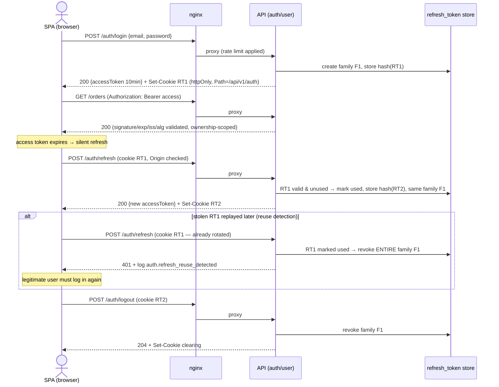

# Security Architecture

> Owner: security-engineer · Date: 2026-07-13 · Basis: ADR-0001, ADR-0002, `architecture-overview.md`, `domain-model.md`
> Status: design-only. Implementation owners are named per requirement (backend-lead, frontend-lead, devops-engineer, database-engineer).
> This document is the auth design doc referenced by skills `authentication`/`authorization` and the source of the auth decision table.

## 1. Trust Boundaries and Threat Model Summary

### 1.1 Assets

| Asset | Where it lives | Impact if compromised |
|---|---|---|
| Credentials (password hashes, reset tokens) | auth/user context, PostgreSQL | Account takeover at scale |
| Tokens (access JWT, refresh token, guest cart token) | Browser memory / httpOnly cookies / refresh-token table | Session hijack, cart theft |
| PII (email, name, addresses) | auth/user context; order snapshots | Privacy breach, legal exposure |
| Order & price integrity | pricing (authority), order (immutable snapshots) | Financial loss (pay-less attacks) |
| Stock & coupon caps | inventory / promotions atomic counters | Oversell, cap-drain fraud |
| Admin audit log | auth/user context (append-only) | Loss of accountability, cover-up of abuse |

### 1.2 Actors and attackers

Legitimate: **guest** (browse/cart, no checkout), **customer**, **admin** (audited, does not shop).
Attackers: anonymous internet attacker (scanning, credential stuffing, enumeration); malicious or
compromised customer (IDOR, price/coupon abuse, race exploitation); script running in the victim's
browser (XSS aiming at tokens); a compromised admin account (highest blast radius — hence audit).

### 1.3 Attack surfaces per trust boundary (from overview §3)

| Boundary | Surface | Primary threats |
|---|---|---|
| Internet → nginx | TLS endpoint, static SPA, `/api/v1` proxy | DoS, TLS downgrade, missing headers, oversized bodies |
| nginx → API | Every REST endpoint | AuthN/AuthZ bypass, injection, enumeration, business-logic abuse |
| Browser runtime | Angular SPA (untrusted code) | XSS → token theft; client-state tampering (never trusted server-side) |
| API → PostgreSQL | JDBC on private network only | Injection (mitigated by JPA binding); credential leakage via env |
| API → payment port | Simulated adapter in-process (v1) | Amount tampering — charge amount is server-computed, never client-supplied. No PAN ever enters the system |

### 1.4 Top ecommerce abuse cases (drive the designs below)

1. **IDOR on orders/carts/profiles** — `GET /orders/{other-id}`. Mitigation: ownership-scoped queries, 404 on unowned (§3).
2. **Price tampering** — client submits totals/prices. Mitigation: server-side price authority; checkout recalculates; orders snapshot server prices only; any client-sent amount is ignored by design.
3. **Coupon brute force & redemption races** — code guessing, parallel redemptions past caps. Mitigation: rate limit coupon-apply endpoint; high-entropy code format (promotions context); atomic check-and-increment in the redeeming transaction; generic "invalid coupon" error.
4. **Credential stuffing / enumeration** — login, register, reset as oracles. Mitigation: §2.6 anti-enumeration rules; per-account + per-IP rate limiting; auth-event logging.
5. **Cart-token theft** — guest cart bearer token stolen via XSS or logs. Mitigation: httpOnly cookie (JS cannot read), high entropy, hashed at rest, never logged, invalidated at merge (§2.7).
6. **Checkout replay / double-charge** — resubmitted payment or placement. Mitigation: idempotency keys on money operations (checkout context); one-directional order state machine rejects duplicate transitions.
7. **Oversell races** — concurrent last-unit checkouts. Mitigation: atomic conditional decrement (inventory context, overview §2) — noted here as a security invariant, owned by domain design.

## 2. Authentication Design

Flows follow skill `authentication`; token mechanics skill `jwt`. Backend-lead implements against this section; deviations return here.

### 2.1 Registration
- Email + password, min length 12, no composition rules; check against breached-password list if feasible (backend-lead may defer with a ticket).
- Email uniqueness enforced at DB; conflict response is generic ("unable to register with this email") and identical in status/shape to success-adjacent errors; the real notice goes by email to the existing owner. No enumeration oracle.
- Password stored with BCrypt (delegating encoder; strength ≥ 10, tune per login-latency budget).
- Emits `UserRegisteredEvent` (audit trail).

### 2.2 Login
- `POST /api/v1/auth/login` → on success: access token in response body + refresh token in cookie (§2.5) + `UserAuthenticatedEvent` (triggers cart merge).
- Failure: 401 with problem type `invalid-credentials` — identical body and status whether the user exists or not; unknown-user path runs BCrypt against a fixed dummy hash (constant-time discipline).
- Rate limited per-IP at nginx (devops-engineer) AND per-account in the app (backoff/lockout counter, auth/user context — backend-lead). 429 with `Retry-After` when tripped.

### 2.3 Token pair and refresh rotation with reuse detection
- **Access token**: JWT, 10 min TTL, held in SPA memory only (never localStorage/sessionStorage — frontend-lead).
- **Refresh token**: opaque high-entropy value (not a JWT), 128+ bits from SecureRandom, stored server-side **hashed**, delivered in an httpOnly Secure cookie (§2.5).
- **Rotation**: every call to `/api/v1/auth/refresh` validates the presented token, marks it used, issues a new refresh token in the same family, returns a new access token. One-time use, strictly.
- **Reuse detection**: presenting an already-rotated/used refresh token = theft signal → revoke the entire family (all descendants), log `auth.refresh_reuse_detected` with correlation id, return 401. The legitimate user re-authenticates.
- **Family lifetime**: 14 days absolute from login; no sliding extension in v1. Family table doubles as session inventory for a future "active sessions" screen.

### 2.4 Logout and global revocation
- Logout = server-side revocation of the presented token's family + `Set-Cookie` clearing. Client-side-only logout is a review-blocking finding.
- Password change (logged-in, requires current password): revokes all *other* families; email notification.
- Password reset consumption: revokes **all** families (possible compromise).

### 2.5 Cookie and endpoint hardening for cookie-authenticated auth endpoints
- Refresh cookie: `HttpOnly; Secure; SameSite=Strict; Path=/api/v1/auth` — sent only to refresh/logout, invisible to JS, never on cross-site requests.
- Because refresh/logout are cookie-authenticated while the API is otherwise CSRF-exempt (stateless bearer), these two endpoints get CSRF compensation: `Origin` header validated against the configured frontend origin (backend-lead). SameSite=Strict is the first layer; the Origin check is the second.

### 2.6 Anti-enumeration rules (apply to every auth flow)
- Login: generic error + dummy-hash timing (§2.2).
- Password reset request: always 202 "if that account exists, an email was sent" — both branches, same timing class.
- Reset token: single-use, ≤ 1h TTL, ≥ 128-bit random, stored hashed; invalid/expired/reused → one generic 400 `invalid-or-expired-token`. Requesting a new token invalidates the previous.
- Registration conflict: generic response + email-notice pattern (§2.1).
- test-engineer asserts identical status + body shape for exists/not-exists branches (API tier).

### 2.7 Guest cart token
- Guest identity is real identity: opaque token, ≥ 128-bit SecureRandom, **not** a UUIDv7 (bearer secrets require full entropy — §6a), stored hashed server-side against the cart row.
- Delivered as `HttpOnly; Secure; SameSite=Lax; Path=/api/v1` cookie; TTL matches cart expiration policy (shopping-cart domain).
- Never appears in URLs, logs, or response bodies. On login, `UserAuthenticatedEvent` triggers merge; the guest token is invalidated at merge — it never resolves to the customer's cart.

### 2.8 Auth event logging
Log (with correlation ids, never credentials/tokens): login success/failure, lockout, refresh, refresh-reuse detected, logout, reset requested/consumed, password changed, registration. These feed A09 monitoring.

### 2.9 Session lifecycle sequence

## 3. Authorization Model

### 3.1 Roles
`GUEST` (anonymous, identified only by cart token), `CUSTOMER`, `ADMIN`. Flat, no hierarchy (v1);
new roles require an ADR. Admins do not shop: cart/checkout endpoints deny `ADMIN` (403) — role
separation per domain-model §auth/user.

### 3.2 Two enforcement layers
1. **Coarse (route)** — `SecurityFilterChain` matchers: explicit public allowlist (auth endpoints, catalog GETs, health), `/api/v1/admin/**` requires `ADMIN`, everything else `authenticated()`. Deny by default.
2. **Fine (operation)** — `@PreAuthorize` on application-layer use cases + **ownership checks in code**: the repository query scopes by owner (`findByIdAndCustomerId`) so unowned data is unfetchable, not merely filtered. Principal derives from `SecurityContext` via one adapter (`CurrentUserPort`); any caller-identifying id in a request body is a review-blocking finding.

### 3.3 Ownership failures return 404, never 403
404 on someone else's resource — do not confirm existence (A01). 403 is reserved for "authenticated, but the operation is not for your role" (e.g., admin hitting checkout).

### 3.4 Auth decision table — SEED (by endpoint category)

Concrete endpoints do not exist yet; backend-lead expands this into one row **per endpoint** as
each is designed, and no endpoint merges without its row. This seed is the law until then.

| Category | GUEST | CUSTOMER | ADMIN | Ownership / notes |
|---|---|---|---|---|
| Public catalog reads (products, categories, search) | ✓ | ✓ | ✓ | none; ACTIVE products only for non-admin |
| Auth endpoints (register, login, refresh, logout, reset) | ✓ | ✓ | ✓ | rate-limited; anti-enumeration §2.6; refresh/logout cookie + Origin check |
| Cart operations (create, read, add/update/remove line) | ✓ via own cart token | ✓ own cart (customerId = sub) | — (403) | cart must belong to the presenting identity, else 404; guest token never mixes with customer carts post-merge |
| Customer-scoped reads/ops (orders list/detail, cancel, profile, addresses) | — (401) | ✓ own → else 404 | ✓ order lifecycle mgmt only, audited; no profile access without audit | `order.customerId == sub` via scoped query; cancel additionally gated by lifecycle state |
| Checkout & payment ops (start, confirm total, apply coupon, pay) | — (401) | ✓ own session only, else 404 | — (403, admins don't shop) | idempotency key on placement/payment; totals server-computed; coupon apply rate-limited |
| Admin ops (`/api/v1/admin/**`: catalog CRUD, prices, stock, promotions, order lifecycle) | — | — (403) | ✓ | ADMIN at both layers; every mutation audit-logged (§6c) |

Test contract per row (test-engineer): anonymous → 401, wrong role → 403, wrong owner → 404,
right principal → 2xx. An endpoint-mapping introspection test asserts every endpoint has a row.

## 4. OWASP Top 10 Mapping

| Category | Design mechanism in this architecture |
|---|---|
| A01 Broken Access Control | Decision table (§3.4) + ownership-scoped queries + 404-on-unowned; UUIDv7 kills enumeration recon (§6a); explicit CORS for the one frontend origin |
| A02 Cryptographic Failures | BCrypt passwords; TLS at nginx; JWT HMAC key ≥ 256-bit from env (§6b); reset/refresh/cart tokens stored hashed; no PII in JWT payloads or URLs; no custom crypto |
| A03 Injection | JPA parameter binding only; dynamic sort/filter allowlisted (secure-coding); no OS exec from request data; Angular interpolation auto-escaping, `[innerHTML]`/`bypassSecurityTrust*` require security sign-off |
| A04 Insecure Design | Server-side price authority + re-confirmation (overview §2); idempotency on money ops; atomic stock/coupon counters; this threat model (§1.4) covers business abuse cases |
| A05 Security Misconfiguration | Minimal actuator exposure (health only, unauthenticated; rest ADMIN or off); RFC 9457 errors, no stack traces; nginx headers baseline (§5.2); no seeded default credentials — first admin bootstrapped via one-time env-provided setup, forced rotation |
| A06 Vulnerable Components | Dependency audit in CI blocking on criticals (devops-engineer); every new dependency architect-approved; pinned versions + lockfiles |
| A07 Auth Failures | §2 in full: rate limiting (both layers), generic errors + dummy-hash timing, rotation + family reuse detection, password policy |
| A08 Integrity Failures | Pinned GitHub Actions and digested base images (devops-engineer); Jackson to typed records only, no native deserialization; Flyway append-only migrations |
| A09 Logging & Monitoring | Auth events + admin audit log with correlation ids (§2.8, §6c); log-scrubbing rules (no tokens/secrets/unmasked PII); Gate 4 checks new log lines |
| A10 SSRF | No server-side fetch of user-influenced URLs exists in v1 (payment simulated in-process). Standing rule: any future URL-fetching feature requires host allowlist + no blind redirects + threat model here first |

## 5. Secrets and Configuration Policy

### 5.1 Secrets
- **Env-only, no defaults**: every secret (DB password, JWT signing key, future SMTP/PSP creds) is injected via environment; `application.yml` contains placeholders with **no fallback values** — a missing secret fails startup loudly. Owner: backend-lead (config), devops-engineer (injection via Compose env files).
- `.env` gitignored; `.env.example` maintained with names + comments, never values. Compose files contain no literal secrets, dev included.
- A committed secret is a **rotated** secret, immediately — no exceptions, plus history-scrub ticket.
- Rotation notes: JWT signing key supports rotation via `kid` header and a dual-key acceptance window (old key verifies, new key signs) so rotation needs no downtime and no mass logout (§6b). DB credentials rotated on any suspected exposure and on team-member departure. Reset/refresh tokens rotate by design.
- Secrets never in logs, URLs, exceptions, or error responses; token comparisons constant-time; raw token values exist only in transit — at rest, hashes.

### 5.2 Security headers & edge hardening (requirements → devops-engineer, verifiable checklist)
- `Strict-Transport-Security` (max-age ≥ 6 months) once TLS is stable; HTTP→HTTPS redirect.
- `Content-Security-Policy` for the SPA: default-src 'self'; no inline script allowances without security sign-off; frame-ancestors 'none'.
- `X-Content-Type-Options: nosniff`, `Referrer-Policy: strict-origin-when-cross-origin`, restrictive `Permissions-Policy`.
- `server_tokens off`; request body size limits at nginx AND app; timeouts tuned.
- Rate limiting zones at nginx: `/api/v1/auth/**` (tight) and the coupon-apply endpoint (tight); sane default elsewhere. App-level per-account limits complement (per-IP alone fails under CGNAT/rotation).
- CORS: exact frontend origin(s) from configuration, credentials allowed only for that origin, never `*`.

## 6. Answers to the Architect's Three Flagged Questions

### 6a. UUIDv7 timestamp leakage — verdict: **ACCEPTED, with conditions**
The embedded millisecond timestamp leaks only coarse creation time of a single resource the caller
already knows the id of — negligible recon value and no volume leak (unlike sequential ids).
Conditions, binding: (1) authorization NEVER relies on id unguessability — every by-ID endpoint
enforces ownership/role per §3, verified by the per-row authZ tests; ids are identifiers, not
capabilities. (2) UUIDv7 is **never used for bearer secrets** — refresh tokens, password-reset
tokens, guest cart tokens, idempotency keys where secrecy matters, and coupon codes use full-entropy
SecureRandom generation instead. With those conditions, ADR-0002's ID sub-decision is **signed off**;
database-engineer may proceed with the first migration.

### 6b. JWT token policy — verdict: **as specified in §2, concretely:**
Access token: JWT, **10 min TTL**, claims `sub`, `roles`, `iat`, `exp`, `jti` only (no PII), in-memory
storage. Refresh token: opaque 128+ bit random, **one-time use with rotation**, 14-day absolute
family lifetime, httpOnly/Secure/SameSite=Strict cookie scoped to `/api/v1/auth`. Revocation =
**refresh-family table** (family id, hashed token, user id, issued/expires, used/revoked flags,
replaced-by link): logout revokes the family, reuse of a rotated token revokes the family, password
reset revokes all families. No access-token blacklist — 10 minutes is the mitigation; sensitive
admin operations may re-verify against the DB. Algorithm: **HS256 pinned** (single issuer =
verifier in a modular monolith; asymmetric adds key-pair ops for zero benefit in v1), secret
≥ 256 bits from env, `alg` never read from the token header, `none` rejected, issuer/audience
validated, clock skew ≤ 60s. Migration trigger: any second token-verifying service → switch to
RS256/ES256 via ADR. Key rotation via `kid` + dual-key window (§5.1).

### 6c. Admin audit log — verdict: **append-only, enforced at two levels**
Every admin mutation records: acting user id + role, action type, target resource type + id,
**before/after state** (scrubbed of credentials/secrets; PII minimized to what the action touched),
timestamp, correlation id, source IP. Requirements: (1) app level — the audit repository exposes
insert and read **only**; no update/delete methods exist; ArchUnit/test asserts this (backend-lead,
test-engineer). (2) DB level — the application's database role is granted INSERT/SELECT but not
UPDATE/DELETE on the audit table (database-engineer, first migration). (3) Audit write happens in
the same transaction as the audited mutation — an action without its audit row must not commit.
(4) `bigint identity` PK is fine (never client-addressed, per ADR-0002). (5) Retention: keep ≥ 1
year in v1, no purge path implemented; any future purge/archival policy is a product-owner + user
decision recorded by ADR, never a quiet DELETE.
